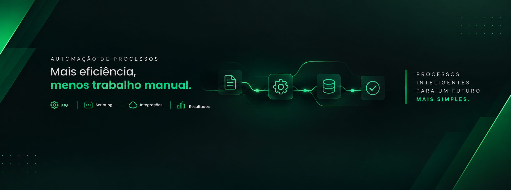

<!-- Banner: substitua pela sua imagem de banner (ex: assets/banner.jpg) após subir no repositório -->

 

<h1>Vinicius Correia</h1>

  

 

## 🧭 Sobre mim

Sou **Analista de Suporte N2**, especializado em **Automação Workplace** e em transformar processos manuais de TI em soluções escaláveis. Minha jornada começou no suporte técnico e infraestrutura, e hoje está migrando cada vez mais para **Automação, Dados e Inteligência Artificial aplicada a ambientes corporativos**.

Gosto de identificar tarefas repetitivas e transformá-las em ferramentas de autosserviço que economizam tempo, reduzem erro humano e devolvem autonomia para o usuário final.

> *"If it happens twice, maybe it can be automated."* ⚙️

- 🔭 Atualmente desenvolvendo a **Workplace Automation Platform (WAP)** e a **Central de Termos Workplace**
- 🌱 Aprofundando conhecimento em **Automação, RPA, IA aplicada a processos e Power BI**
- 🎓 Cursando **Tecnólogo em Gestão de Tecnologia da Informação**
- 🌍 Já atuei como ponto focal Brasil em projeto internacional de automação (IVANTI) com equipes dos EUA e México
- 💬 Fale comigo sobre **automação de suporte, PowerShell, Copilot Studio ou Service Desk**

 

## 🧰 Stack &amp; Ferramentas

**Linguagens**
 

**Automação &amp; IA**
 

**Dados &amp; Analytics**
 

**Infraestrutura**
 

 

## 🚀 Projetos em destaque

<table>
<tr>
<td width="50%" valign="top">

### ⚙️ [Workplace Automation Platform (WAP)](https://github.com/ViCodax/Workplace-Automation-Platform-ptbr)

Toolkit de automação em PowerShell para suporte Workplace — reduz tarefas manuais, padroniza troubleshooting e permite distribuição centralizada via SCCM.

`PowerShell` `SCCM` `Automation` `Self-Service`

</td>
<td width="50%" valign="top">

### 🤖 [Central de Termos Workplace](https://github.com/ViCodax/Central-de-Termos---Workplace)

Agente de IA em Microsoft Copilot Studio que automatiza a geração de documentos de entrega/devolução de equipamentos a partir de dados corporativos.

`Copilot Studio` `AI Agents` `Automation` `Integration`

</td>
</tr>
</table>

 

## 📊 GitHub Stats

<!--

-->
 

 

## 📫 Vamos conversar

  

São Domingos, São Paulo — Brasil 🇧🇷

